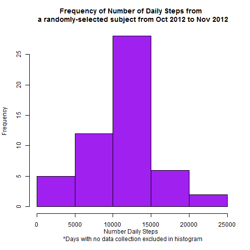
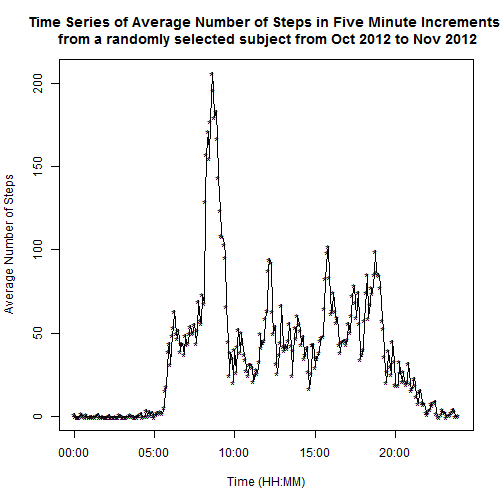
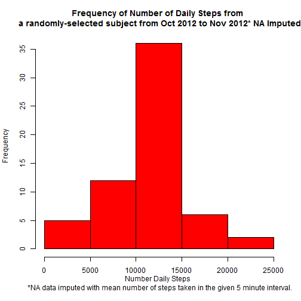
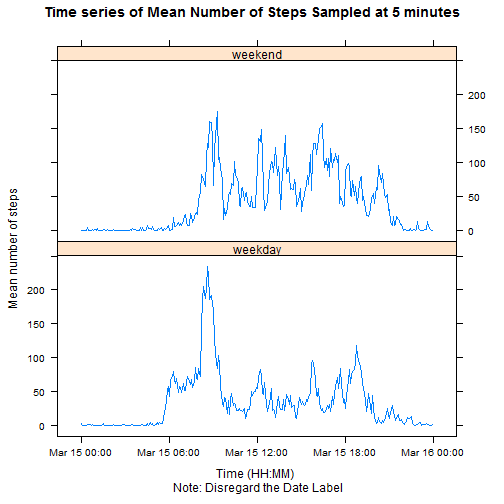

# Data Analysis of Personal Movement Activity 
# of a Randomly-Selected Subject 
# from October 2012 to November 2012 


```r
## Checks local directory for dataset. If it doesn't exist locally, 
## downloads it and stores it directory movement_data from working directory.
url <- "https://d396qusza40orc.cloudfront.net/repdata%2Fdata%2Factivity.zip"
if (!file.exists("./movement_data/activity.csv")){
        message("Downloading data")
        install.packages("downloader"); library(downloader)
        download(url, destfile = './movement_data.zip')
        unzip ("movement_data.zip", exdir ="./movement_data")
        }
data <- read.csv("./movement_data/activity.csv", stringsAsFactors=F)
 
## Loads the necessary library for the data analysis.
library(dplyr)
library(ggplot2)
library(lattice)
```

## What is mean total number of steps taken per day?

```r
## Sums the number of steps by date.
## Calculates the number of days where no data was recorded 
## along with the mean and the median of the number of daily steps.
data.daily <- data %>%
        group_by (date) %>%
        summarise (daily.steps = sum(steps))

mean.daily <-format(mean(data.daily$daily.steps, na.rm=T), digits=5)
median.daily <- format(median(data.daily$daily.steps, na.rm=T), digits=5)
days.NA <- sum(is.na(data.daily$daily.steps))

## Plots the histogram of the number of daily steps.
hist(data.daily$daily.steps,
     main = "Frequency of Number of Daily Steps from \n a randomly-selected subject from Oct 2012 to Nov 2012",
     xlab = "Number Daily Steps \n *Days with no data collection excluded in histogram",
     col = "purple")
```

 

There were 8 days when absolutely no data was collected.

Exluding the days with no data collection, the mean of total number of daily steps
taken was 10766 while the median was 10765.

## What is the average daily activity pattern?

```r
## Calculates the the average number of steps taken sampled at 5 minute period
## over the 2 months.
data.5minavg <- data %>%
        group_by(interval) %>%
        summarise (avg.5min = mean(steps, na.rm=T))
data.5minavg$interval <- formatC(data.5minavg$interval, width=4, flag="0")
data.5minavg$interval <- as.POSIXct(strptime(data.5minavg$interval, "%H%M"))

## Plots a time series of the average number of steps sampled at 5 minutes.
plot(data.5minavg$interval, data.5minavg$avg.5min,
     xlab = "Time (HH:MM)",
     ylab = "Average Number of Steps",
     main = "Time Series of Average Number of Steps in Five Minute Increments \n from a randomly selected subject from Oct 2012 to Nov 2012",
     type='l')
points(data.5minavg$interval, data.5minavg$avg.5min, pch='*')
```

 

```r
## Calculates the 5 minute inveral with the maximum of the average number
## of steps as well as the maximum number of average steps.
max.steps <- arrange(data.5minavg, desc(avg.5min))[1,]
max.time <- as.POSIXlt(max.steps$interval)
max.steps.time1 <- paste(max.time$hour, max.time$min, sep=":")
max.steps.time2 <- paste(max.time$hour, max.time$min+5, sep=":")
```

The five minute interval with the maximum number of averaged steps occur from 8:35 to 8:40. During this 5 minute interval, the average number of steps in the two months is 206.

## Imputing missing values

```r
## Extracts from the data where NA occurs.
num.NA <- sum(is.na(data$steps))
data.NA <- filter(data, is.na(steps))

## 5-minute mean value calculated excluding the NA.
impute.5minavg <- data %>%
        group_by(interval) %>%
        summarise (avg.5min = mean(steps, na.rm=T))

## NA data replaced with the 5-minute mean value for the given sampling 
## time period.
Log.impute <- match(data.NA$interval, impute.5minavg$interval)
data.NA$steps <- impute.5minavg$avg.5min[Log.impute]
data.imputed <- rbind(data, data.NA)
data.imputed <- data.imputed[complete.cases(data.imputed),]
data.imputed <- arrange(data.imputed, date, interval)

## Number of daily steps taken calculated with imputed data.
data.imputed.dailytotal <- data.imputed %>%
        select(steps, date) %>%
        group_by(date) %>%
        summarise(daily.steps=sum(steps))

mean.imputed <-format(mean(data.imputed.dailytotal$daily.steps), digits=5)
median.imputed <- format(median(data.imputed.dailytotal$daily.steps), digits=5)

## Histogram plotted of the daily steps taken with the imputed data.
hist(data.imputed.dailytotal$daily.steps,
     main = "Frequency of Number of Daily Steps from \n a randomly-selected subject from Oct 2012 to Nov 2012* NA Imputed",
     xlab = "Number Daily Steps \n *NA data imputed with mean number of steps taken in the given 5 minute interval.",
     col = "red")
```

 

In the data set, there are 2304 NA's. 


```r
## Table of mean & median of the dataset where NA's are removed 
## and NA's are imputed with 5minute interval mean.
TB <- matrix(c(mean.daily, median.daily, mean.imputed, median.imputed),2,2)
rownames(TB) <- c("Mean", "Median")
colnames(TB) <- c("NA removed-Data", "Imputed with 5min-avg-Data")

knitr::kable(TB)
```


|       |NA removed-Data |Imputed with 5min-avg-Data |
|:------|:---------------|:--------------------------|
|Mean   |10766           |10766                      |
|Median |10765           |10766                      |


As a comparison, we imputed all NA values with its 5-minute interval average for its given time period. As shown on the table, the mean and median did not change significantly whether NA value was removed or was imputed with the 5-minute interval average.

## Are there differences in activity patterns between weekdays and weekends?

```r
data$weekday <- weekdays(as.Date(data$date, format="%Y-%m-%d"))
data <- data %>%
        mutate(Wkend = ifelse(weekday == "Saturday"| weekday == "Sunday",
                              "weekend",
                              "weekday")
               )
data.wk <- data %>%
        group_by(interval, Wkend) %>%
        summarise(mean.steps = mean(steps, na.rm=T))
data.wk$Wkend <- as.factor(data.wk$Wkend)
data.wk$interval <- formatC(data.wk$interval, width=4, flag="0")
data.wk$interval <- as.POSIXct(strptime(data.wk$interval, "%H%M"))
plot.wk <- xyplot(mean.steps ~ interval | Wkend, 
                  data = data.wk, 
                  layout = c(1,2), 
                  type ='l',
                  xlab = "Time (HH:MM) \n Note: Disregard the Date Label",
                  ylab = "Mean number of steps",
                  main = "Time series of Mean Number of Steps Sampled at 5 minutes")

print(plot.wk)
```

 

There are more movements in the morning time on the weekdays compared to the same time period on the weekends. Also, the personal movements begin earlier in the day on weekdays compared to the weekends. The peak activity on weekends terminates later in the evening compared to the weekdays. There's also bigger variation in the personal activity on the weekends than weekdays.
